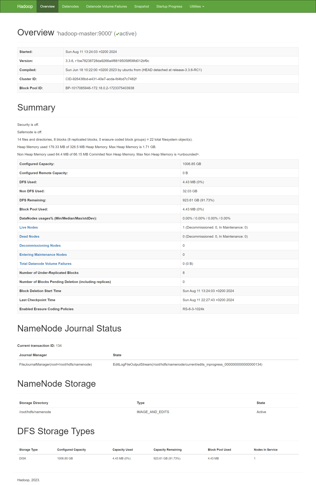
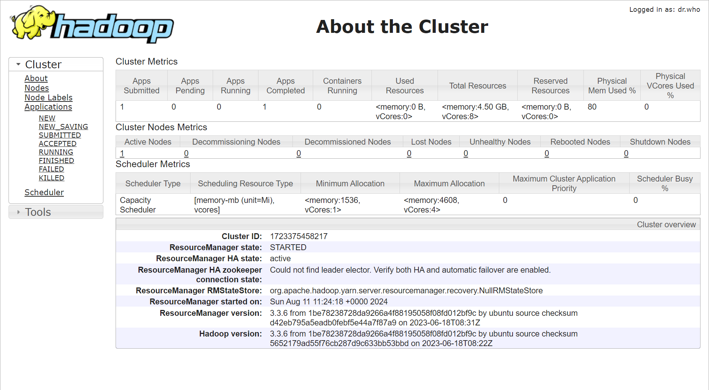
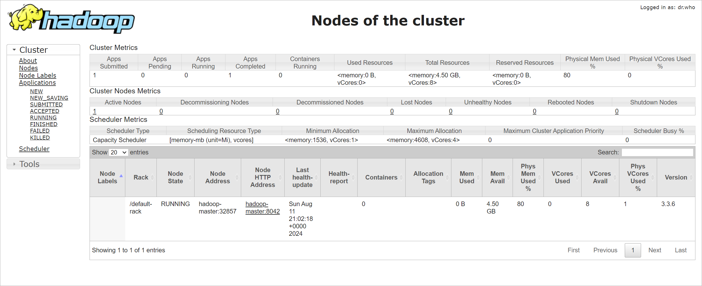
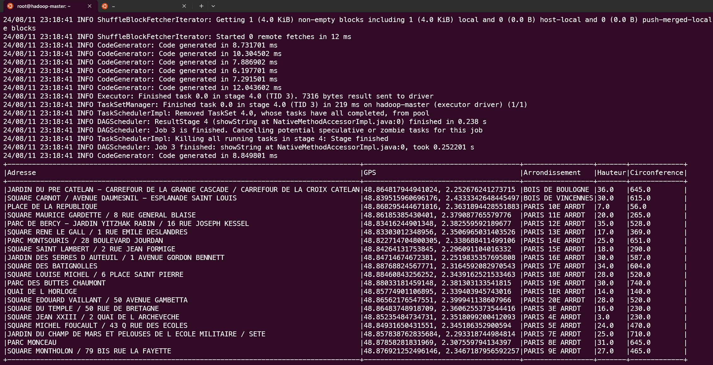
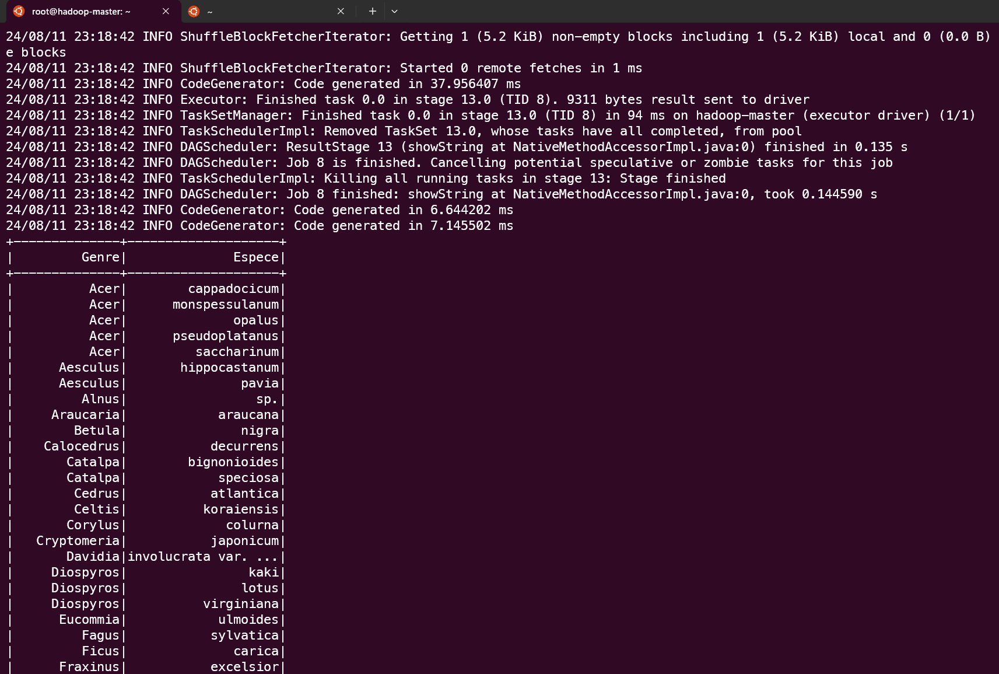
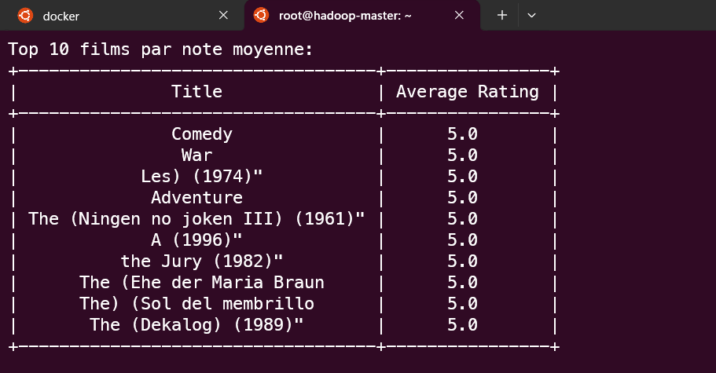
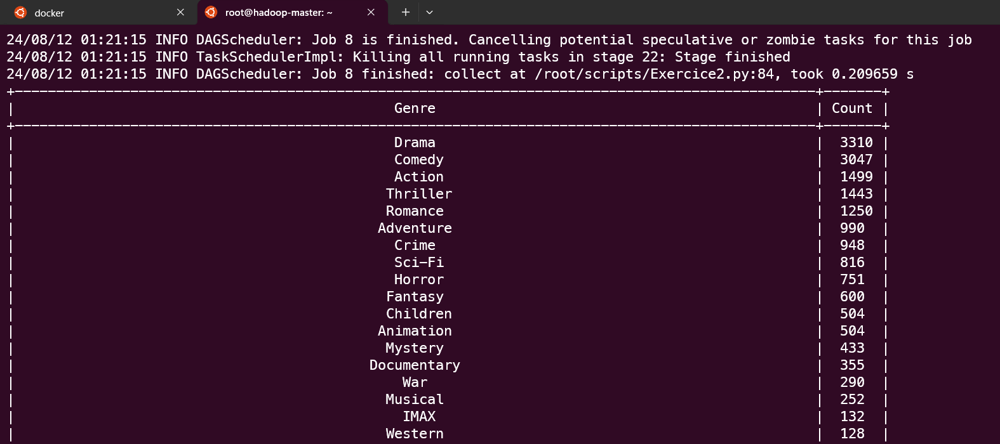

## TP FINAL BIGDATA

Résultat du TP Final de BigData réalisé par Kévin Barbin.

# Lancement

Effectuer les étapes dans cet ordre :  
Faire un `git clone` du repository `https://github.com/Lingatsu/TpBigData.git`  
Ensuite  :
`docker-compose up` ou `docker compose up`  

Ouvrir un autre onglet du terminal et faire :  
`sudo docker exec -it hadoop-master bash`  
`/usr/local/hadoop/bin/hdfs namenode -format`  
`./start-hadoop.sh`  
`jps` pour vérifier que Jps, DataNode, NameNode, SecondaryNameNode, ResourceManager, NodeManager sont lancés  

`hdfs dfs -mkdir -p /user/root/input/`  
`hdfs dfs -put /root/hdfs-input/* /user/root/input/`  

Pour lancer l'exercice 1  
`spark-submit --deploy-mode client --master local[2] ./scripts/Exercice1.py input/arbresremarquablesparis2.csv`  

Pour lancer l'exercice 2  
`pip install prettytable`  
`spark-submit --deploy-mode client --master local[2] ./scripts/Exercice2.py input/`  

# Docker hub

Image sur docker hub afin de relancer la configuration:  
[lingatsu/tp-final-bigdata](https://hub.docker.com/r/lingatsu/tp-final-bigdata)  

# Résultat Final

# Conclusion

Un volume "hdfs-input" a été monté pour persister les données entre la machine local et le container. J'ai également tenté d'automatiser la configuration du docker compose en faisant un format et un bash au lancement. Mais je n'y suis pas parvenu. Le container hadoop master s'éteignait systématiquement ou faisait une "connection refused" sur le port 22 alors que les noeuds via le compose étaient configuré en local.

